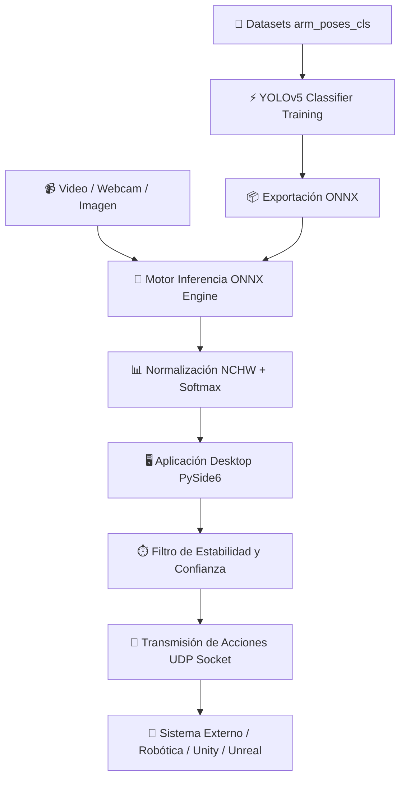

# 🦾 IntelliGest: Real-Time Human Pose Gesture Recognition & Control

[](LICENSE)
[](https://www.python.org/downloads/)
[](https://onnxruntime.ai/)
[](https://www.qt.io/qt-for-python)
[](https://github.com/ultralytics/yolov5)

**IntelliGest** es una plataforma profesional de visión por computador para el **reconocimiento de poses y gestos de brazos humanos en tiempo real**. El sistema integra un motor de inferencia optimizado en **ONNX Runtime**, una aplicación de escritorio interactiva en **PySide6**, un pipeline reproducible de entrenamiento/exportación con **YOLOv5**, y un módulo de transmisión **UDP** de alta frecuencia para teleoperación, robótica, simulación y motores de videojuegos (Unity, Unreal Engine, VRChat/OSC).

---

## 🏗️ Arquitectura del Sistema



---

## ✨ Características Principales

- **Inferencia en Tiempo Real**: Ejecución acelerada con ONNX Runtime en CPU, CUDA o DirectML.
- **Aplicación de Escritorio Interactiva**: GUI construida con PySide6 con vista en vivo, indicador de confianza por clase, control FPS y envío de acciones en red.
- **Transmisión UDP Robusta**: Filtro de estabilidad temporal configurable para evitar falsos positivos y rebotes de eventos antes del envío por socket UDP.
- **Taxonomías Modulares**: Configuración desacoplada mediante JSON para fácil adición de nuevas poses y mapeo de acciones.
- **Pipeline Reproducible**: Herramientas CLI unificadas para validación de perfiles, entrenamiento y exportación a ONNX.

---

## 🚀 Inicio Rápido

### Requisitos Previos

- Python 3.10 o superior.
- Cámara web (para la aplicación de escritorio en vivo).

### 1. Instalación

```bash
# Clonar el repositorio
git clone https://github.com/tu-usuario/IntelliGest.git
cd IntelliGest

# Crear entorno virtual
python -m venv .venv

# Activar entorno virtual
# En Windows (PowerShell):
.\.venv\Scripts\Activate.ps1
# En Linux/macOS:
# source .venv/bin/activate

# Instalar dependencias con soporte GUI
python -m pip install -e ".[desktop]"
```

### 2. Verificar la Configuración

Puedes validar la configuración del sistema sin requerir cámara o modelos cargados:

```bash
intelligest-desktop --check-config --no-udp
```

### 3. Ejecutar la Aplicación de Escritorio

```bash
# Iniciar con la cámara web principal (índice 0)
intelligest-desktop --source 0

# O especificar un modelo ONNX y perfil de acciones personalizado:
intelligest-desktop --model ruta/a/modelo.onnx --contract configs/models/arm_poses_7_app.json
```

---

## 📊 Taxonomía de Gestos y Poses

El sistema utiliza el perfil canónico **`arm_poses_7`** definido en [`configs/datasets/arm_poses_7.json`](file:///c:/Users/felip/OneDrive/Desktop/IntelliGest-consolidado/configs/datasets/arm_poses_7.json):

| Perfil | N° Clases | Clases de Gestos Soportadas | Estado |
|---|---:|---|---|
| **`arm_poses_7`** | **7** | `arms_crossed`, `arms_side`, `arms_up`, `left_arm_side`, `left_arm_up`, `right_arm_side`, `right_arm_up` | **Canónico** |

---

## 📈 Inspección y Evaluación Offline de Modelos ONNX

### Inspección de Metadatos ONNX
```bash
intelligest inspect-onnx --model ruta/a/modelo.onnx --expected-classes 7
```

### Evaluación Offline y Matriz de Confusión Gráfica
```bash
# Evaluación con el perfil arm_poses_7
intelligest evaluate-onnx --profile arm_poses_7 --eval-out reports/generated/confusion_matrix.png

# O desde intelligest-desktop:
intelligest-desktop --contract configs/models/arm_poses_7_app.json --eval
```

## 🏋️ Entrenamiento y Exportación a ONNX

### Entrenamiento con YOLOv5

IntelliGest incluye una implementación integrada de YOLOv5 en `third_party/yolov5`. Para entrenar un nuevo modelo de clasificación de gestos:

```bash
# Instalar dependencias de entrenamiento
python -m pip install -e ".[train]"
python -m pip install -r third_party/yolov5/requirements.txt

# Iniciar entrenamiento (agrega --execute para confirmar)
intelligest train --profile arm_poses_7 --epochs 100 --batch-size 16 --execute
```

### Exportación a ONNX

Una vez obtenido el archivo de pesos `.pt` entrenado:

```bash
intelligest export-onnx --weights runs/train-cls/exp/weights/best.pt --imgsz 224 --execute
```

---

## 📡 Integración UDP

Las acciones transmitidas en red se configuran en `configs/actions/`. El sistema aplica un **filtro de estabilidad temporal** (duración mínima y umbral de confianza) para emitir el payload correspondiente.

Ejemplo de configuración (`configs/actions/arm_poses_7.json`):

```json
{
  "profile": "arm_poses_7",
  "transport": "udp",
  "host": "255.255.255.255",
  "port": 1097,
  "broadcast": true,
  "minimum_stable_seconds": 1.5,
  "minimum_confidence": 0.5,
  "class_payloads": {
    "arms_crossed": "crossed",
    "arms_side": "side_both",
    "arms_up": "up_both",
    "left_arm_side": "left_side",
    "left_arm_up": "left_up",
    "right_arm_side": "right_side",
    "right_arm_up": "right_up"
  }
}
```

---

## 🧪 Pruebas y Control de Calidad

```bash
# Comprobación de compilación de código Python
python -m compileall -q src tests

# Verificación de sintaxis y linting
ruff check .

# Ejecución de la suite de pruebas unitarias
pytest
```

---

## 📂 Estructura del Proyecto

```text
IntelliGest/
├── .github/workflows/    # Workflows de CI/CD para GitHub Actions
├── configs/              # Perfiles de datasets, contratos de modelo y acciones UDP
│   ├── actions/          # Mapeo de payloads UDP por clase
│   ├── datasets/         # Taxonomías y rutas de datasets
│   └── models/           # Contratos de normalización e inferencia ONNX
├── datasets/             # Datasets de entrenamiento y validación
│   └── arm_poses_cls/    # Dataset de 7 clases de poses de brazos
├── src/intelligest/      # Código fuente del paquete Python
│   ├── app/              # Aplicación de escritorio PySide6
│   ├── export/           # Utilidades de exportación ONNX
│   ├── inference/        # Motor de inferencia ONNX Runtime
│   ├── integrations/     # Socket client UDP y envío de acciones
│   └── training/         # Wrapper de entrenamiento YOLOv5
├── third_party/yolov5/   # Implementación integrada de YOLOv5
└── tests/                # Suite de pruebas unitarias estáticas
```

---

## 📄 Licencia y Atribución

Este proyecto está bajo la Licencia **AGPL-3.0**. Consulta [LICENSE](LICENSE) para más detalles.
Contiene código derivado de Ultralytics YOLOv5. Revisa [THIRD_PARTY_NOTICES.md](THIRD_PARTY_NOTICES.md) para avisos de licencias de terceros.
